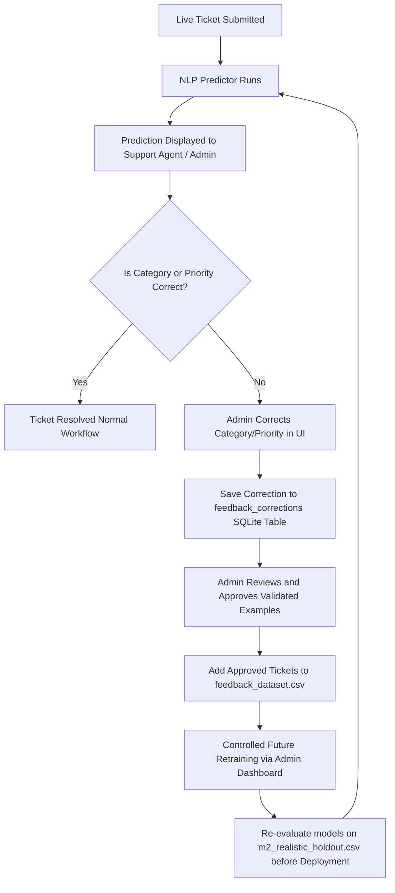

# M3 — Human Feedback and Corrective Self-Learning Architecture

This document describes the foundational architecture design for incorporating human-in-the-loop corrections to refine and retrain our Ticket Classification and Priority Models.

---

## 1. Feedback Loop Architecture Flowchart



---

## 2. Components Design

### A. SQLite Correction Storage (`feedback_corrections`)
A new schema will store the user-provided correction details without altering the live prediction logs directly. This acts as a staging ground.

```sql
CREATE TABLE IF NOT EXISTS feedback_corrections (
    id INTEGER PRIMARY KEY AUTOINCREMENT,
    ticket_id TEXT NOT NULL,
    original_text TEXT NOT NULL,
    predicted_category TEXT NOT NULL,
    predicted_priority TEXT NOT NULL,
    corrected_category TEXT NOT NULL,
    corrected_priority TEXT NOT NULL,
    corrected_by_user TEXT NOT NULL,
    status TEXT DEFAULT 'Pending Review', -- 'Pending Review', 'Approved', 'Rejected'
    created_at TIMESTAMP DEFAULT CURRENT_TIMESTAMP
);
```

### B. Proposed API Endpoints

1. **`POST /api/feedback/correct`**
   - **Access:** Admin/Agent
   - **Payload:**
     ```json
     {
       "ticket_id": "TICK-E8F91A",
       "corrected_category": "Refund",
       "corrected_priority": "High"
     }
     ```
   - **Action:** Inserts or updates the correction in the `feedback_corrections` staging table.

2. **`GET /api/admin/feedback/pending`**
   - **Access:** System Admin
   - **Action:** Fetches all pending corrections for review.

3. **`POST /api/admin/feedback/approve`**
   - **Access:** System Admin
   - **Payload:**
     ```json
     {
       "correction_ids": [1, 2, 5],
       "action": "Approve" -- or "Reject"
     }
     ```
   - **Action:** Updates status in staging and appends approved records to `data/raw/feedback_dataset.csv`.

---

## 3. Retraining and Safety Rules

> [!IMPORTANT]
> **Never Automatically Retrain Models:**
> Online self-learning or automatic retraining from user inputs is highly susceptible to data corruption, poisoning attacks, and model degradation. 

* **Validation Gate:** Any model retraining incorporating the feedback dataset must be initiated manually by an administrator.
* **Regression Testing:** Before a retrained model is put into production, it must pass a strict evaluation against the `data/evaluation/m2_realistic_holdout.csv` dataset, ensuring its accuracy and macro F1 scores do not degrade.
